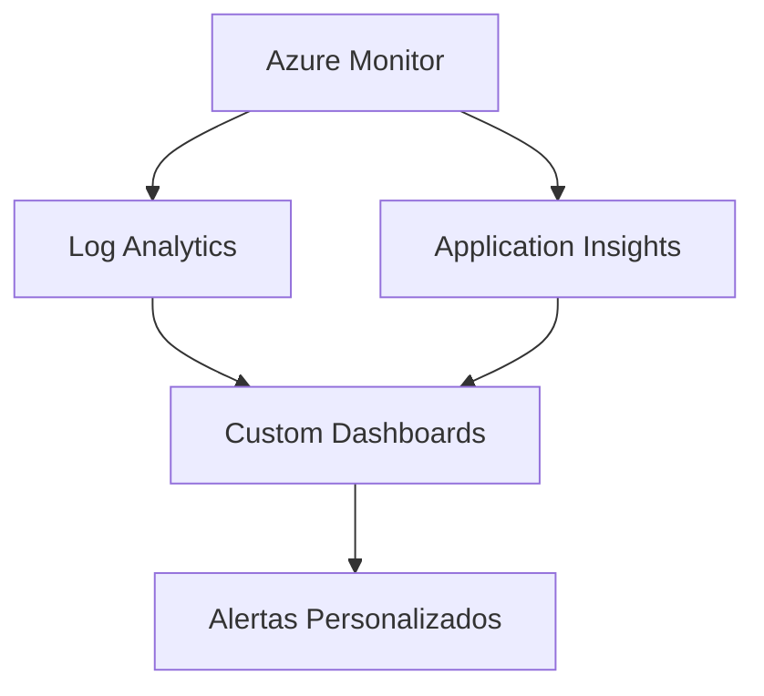
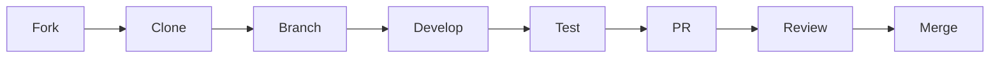

# Azure Cognitive Search - Plataforma Avançada de Busca Inteligente

## 🌟 Visão Geral

Solução empresarial que aproveita o poder do **Azure Cognitive Search** combinado com **AI Enrichment** para transformar dados não estruturados em informações valiosas e pesquisáveis. O sistema oferece:

- Indexação inteligente com enriquecimento de IA
- Busca semântica e por similaridade
- Processamento avançado de documentos
- Integração perfeita com outros serviços Azure

## 🛠️ Arquitetura e Tecnologias

### Núcleo da Plataforma


### Processamento de Dados


### Interface e Operações


## 🚀 Implementação e Configuração

### Pré-requisitos Essenciais
- **Azure Subscription** (nível Free ou superior)
- **Python 3.8+** ou **Node.js 16+**
- **Azure CLI** instalado e configurado
- **Visual Studio Code** com extensão Azure Tools

### 🛠 Configuração Passo a Passo

1. **Preparação do Ambiente Azure**
```bash
az login
az group create --name SearchResourceGroup --location eastus
az search service create --name <service-name> --resource-group SearchResourceGroup --sku standard --location eastus
```

2. **Clone e Configuração do Projeto**
```bash
git clone https://github.com/seu-org/azure-search-platform.git
cd azure-search-platform
python -m venv .venv
source .venv/bin/activate  # Linux/Mac
.venv\Scripts\activate     # Windows
pip install -r requirements.txt
```

3. **Configuração de Variáveis de Ambiente**
```bash
cp .env.example .env
# Edite o .env com suas credenciais
```

4. **Processo de Implantação**
```bash
# Criar índice e skillset
python scripts/create_search_components.py

# Indexar documentos de exemplo
python scripts/index_documents.py

# Iniciar aplicação web
npm start
```

## 🔍 Funcionalidades Principais

### Recursos de Busca Avançada
- 🔍 **Busca Semântica** - Compreensão do intento de pesquisa
- 📑 **OCR Integrado** - Extração de texto de imagens e PDFs
- 🌐 **Processamento Multilíngue** - Suporte a 50+ idiomas

### Pipeline de Enriquecimento
- 🧠 **Reconhecimento de Entidades** - Pessoas, organizações, locais
- 🔗 **Vinculação de Entidades** - Ligações com bases de conhecimento
- 📊 **Análise de Sentimento** - Detecção de polaridade em textos

## 📊 Monitoramento e Métricas



## 📚 Documentação Complementar

🔗 [Guia de Arquitetura](docs/ARCHITECTURE.md) - Diagramas e decisões técnicas  
🔗 [API Reference](docs/API.md) - Documentação Swagger completa  
🔗 [Best Practices](docs/BEST_PRACTICES.md) - Padrões recomendados  

## 🤝 Fluxo de Contribuição



## 📜 Licenciamento

Distribuído sob licença **MIT**. Consulte [LICENSE](LICENSE) para detalhes completos.

---

Desenvolvido com ❤️ por [Eduardo](https://github.com/EduardoMFOliveira) |
